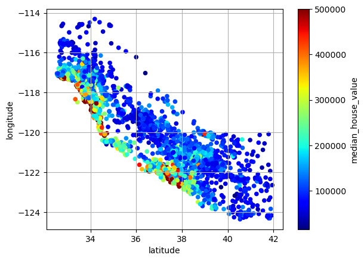
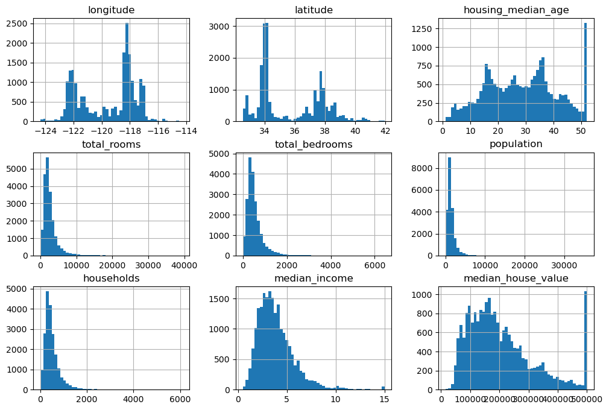
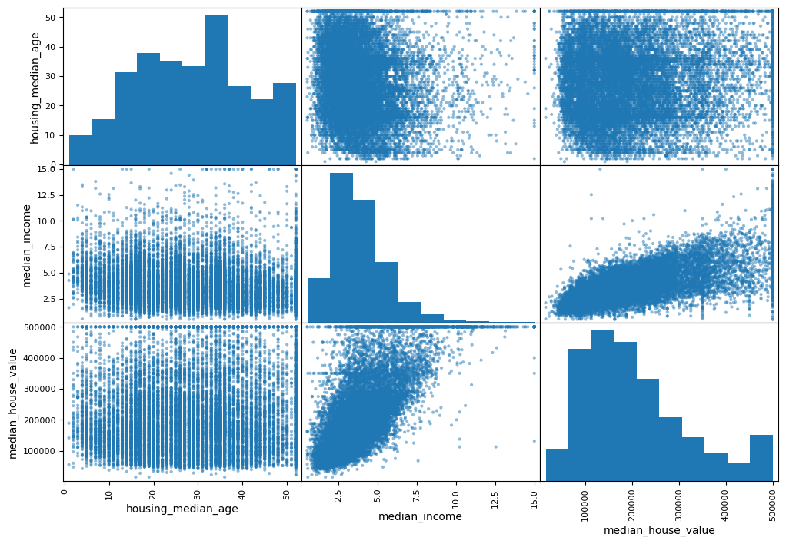
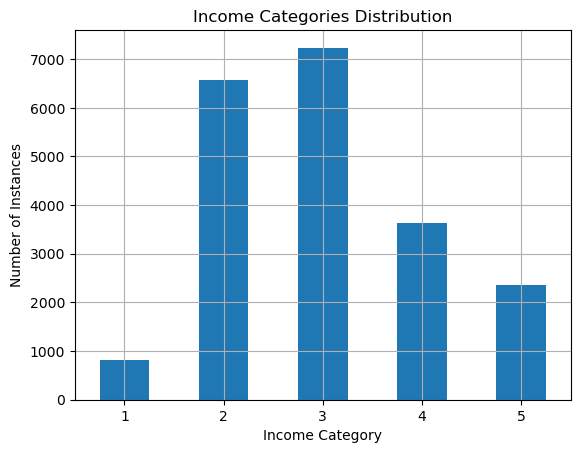

# California Housing Price Prediction

Predicting California housing prices using Machine Learning with a Random Forest Regressor and a complete preprocessing pipeline.

### Geographic Price Distribution
This visualization maps the house prices across California, with red areas indicating higher median house values, which are concentrated near the coast.

## Objective
To build a regression model that can predict the median house value based on demographic, geographic, and economic features from California housing data.

## Data Exploration & Visualization

### Feature Distributions
Histograms of numerical features show many are right-skewed (e.g., `total_rooms`, `population`).

### Correlation Analysis
Scatter matrix reveals strongest correlation between `median_income` and `median_house_value`, making it a key predictive feature.

## Features & Preprocessing
- Preprocesses and scales numerical features, encodes categorical data  
- Handles missing values and adds engineered features  
- Stratified train-test split based on income  
- Trains and evaluates a RandomForestRegressor (R², RMSE)  
- Saves model and preprocessing pipeline with joblib 

**Income Category Distribution for Stratified Sampling:**  

## Model
- **Algorithm:** Random Forest Regressor
- **Training Data:** Trained on 80% of the dataset
- **Evaluation Data:** Evaluated on 20% hold-out test set

## Performance
- **Training Accuracy (R²):** 97.49%
- **Test Accuracy (R²):** 82.91%

## How to Run
1. Clone the repo
2. Install dependencies: `pip install -r requirements.txt`
3. Run the script: `python housing_prediction.py`
4. Outputs predictions in `output.csv`

## Tech Stack
**Language:** Python  
**Libraries:** Pandas, NumPy, Scikit-learn, Matplotlib, Seaborn, Joblib

## Author
Harshit Nigam
